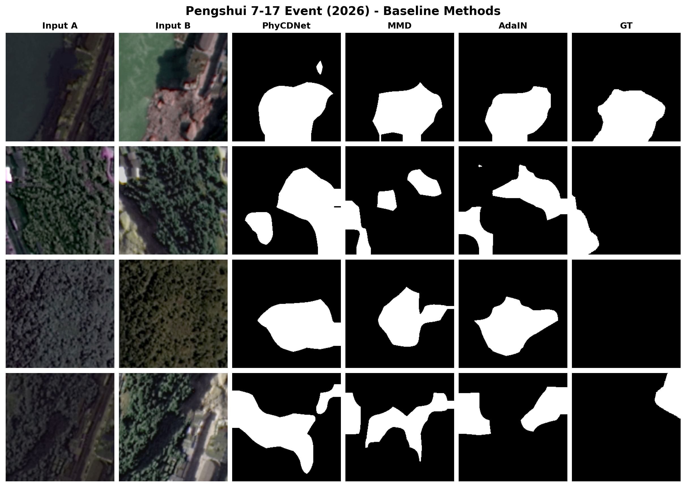

# PRISM: Physics-Guided Causal Change Detection via Algorithm-to-Network Unrolling

This repository provides the official implementation of:

**PRISM: A Physics-Guided Causal Framework for Cross-Sensor Heterogeneous Change Detection in Remote Sensing Images**

---


## Overview

Cross-sensor heterogeneous change detection faces a **triple coupling problem**:

1. **Radiometric inconsistency**: cross-epoch atmospheric and transmittance drift shifts the apparent brightness of unchanged surfaces.
2. **Terrain-induced confounding**: mountain shadows and slope-aspect illumination variation fabricate false alarms indistinguishable from genuine change in feature space.
3. **Boundary uncertainty**: residual terrain confounders leave decoder logits soft and indeterminate near slope boundaries.

Existing approaches treat these as independent preprocessing stages, severing the computational graph and blocking gradient flow. We propose **PRISM**, a physics-guided framework built on an **Algorithm-to-Network (A2N) unrolling paradigm**: each differentiable module is derived directly from the closed-form update rule of its physical subproblem.

---


---

## Total Loss

```
L_total = L_CD + λ₁·(L_phys + R_phys) + λ₂·R_cov + λ₃·R_orth + λ₄·E(M) + λ₅·R_geo(M)
```

| Symbol | Name | Role |
|---|---|---|
| $L_{CD}$ | Change Detection Loss | Focal + Tversky Dice |
| $\lambda_1(L_{phys}{+}R_{phys})$ | Physical consistency (PCRA) | Path-radiance low-pass + transmittance regularity |
| $\lambda_2 R_{cov}$ | Coverage constraint (PCRA) | Prevent $w(\mathbf{x})$ collapse |
| $\lambda_3 R_{orth}$ | Orthogonality (IDTPD) | $F_{ter} \perp F_{chg}$ |
| $\lambda_4 \mathcal{E}(\mathbf{M})$ | Decision entropy (VDR-DEF) | Binary decisiveness |
| $\lambda_5 \mathcal{R}_{geo}(\mathbf{M})$ | Geometric divergence (VDR-EGDR) | Edge-aligned boundaries |

Weights follow a three-phase schedule (physics-dominant → transition → CD-dominant).

---

## Physics Evaluation Metrics

| Metric | Description | Direction |
|---|---|---|
| RCQ | Radiometric Compensation Quality $\|F_1^{corr}-F_2\|_1/(NC)$ | Lower |
| TDI | Terrain Decoupling Index $\langle F_{ter}, F_{chg}\rangle/(NC)$ | Lower |
| MEE | Mean Endpoint Error of displacement field $\varphi$ | Lower |
| EAS | Edge Alignment Score (boundary-region F1) | Higher |

---

## Repository Structure

```
release_prism/
├── README.md                    # 本说明文档
├── figs/                        # 彭水案例可视化（3 张大图）
│   ├── pengshui_caseA.png       #   场景 A：灾前 / 灾后 / 手工真值
│   ├── pengshui_caseB.png       #   场景 B：灾前 / 灾后 / 手工真值
│   └── pengshui_caseB_prism.png #   场景 B：灾前 / 灾后 / PRISM / 手工真值
└── models/                      # 模型代码（唯一代码目录）
    ├── __init__.py              #   公开 API 导出
    ├── networks.py              #   PRISM 主网络 + 退化仿真器 + 编码器/解码器
    ├── pcra.py                  #   PCRA：SPCE + FSRI + RMDC（含 BN/AdaIN/IN 变体）
    ├── idtpd.py                 #   IDTPD：ITPDC + TAGC + DRGCD
    ├── vdr.py                   #   VDR：特征流对齐 + DEF + EGDR（含 DANN/MMD/L2/Hist 变体）
    ├── losses.py                #   总损失 λ₁-λ₅ + 三阶段调度器
    └── phy_metrics.py           #   RCQ / TDI / MEE / EAS 物理指标
```

---


## Requirements

- Python ≥ 3.8
- PyTorch ≥ 1.12, torchvision ≥ 0.13
- numpy, opencv-python, matplotlib, scipy

---

## Real-World Case Study: Pengshui 7·17 Event (2026)

To demonstrate practical utility beyond benchmarks, we evaluate PRISM on
the "Pengshui 7·17" geological disaster event in Chongqing, China.

### Dataset Description

| Item | Description |
|---|---|
| Sensor | GF-7 (Gaofen-7) satellite, courtesy of the China Centre for Resources Satellite Data and Application |
| Acquisition | Pre-disaster: 2026-06-06; Post-disaster: 2026-07-20 |
| Event | Geological disaster (landslide/debris flow) that occurred on 2026-07-17 in Pengshui County, Chongqing |
| Scenes | Two image pairs (Scene A, Scene B) covering the disaster region |
| Challenge | Dense vegetation, complex mountainous topography, sub-optimal imaging conditions post-disaster |
| Labels | Manually interpreted binary change references (changed / unchanged) |

Both scenes exhibit the threefold coupling problem that PRISM targets:
strong cross-epoch radiometric drift, terrain-induced illumination
variation on steep slopes, and cross-resolution geometric offsets
between the pre- and post-event acquisitions.

| Figure | Content |
|---|---|
| `figs/pengshui_caseA.png` | Scene A: Pre / Post / manual reference |
| `figs/pengshui_caseB.png` | Scene B: Pre / Post / manual reference |
| `figs/pengshui_caseB_prism.png` | Scene B: Pre / Post / PRISM / manual reference |

+  
+  
+  
+  
+  
+  


---


